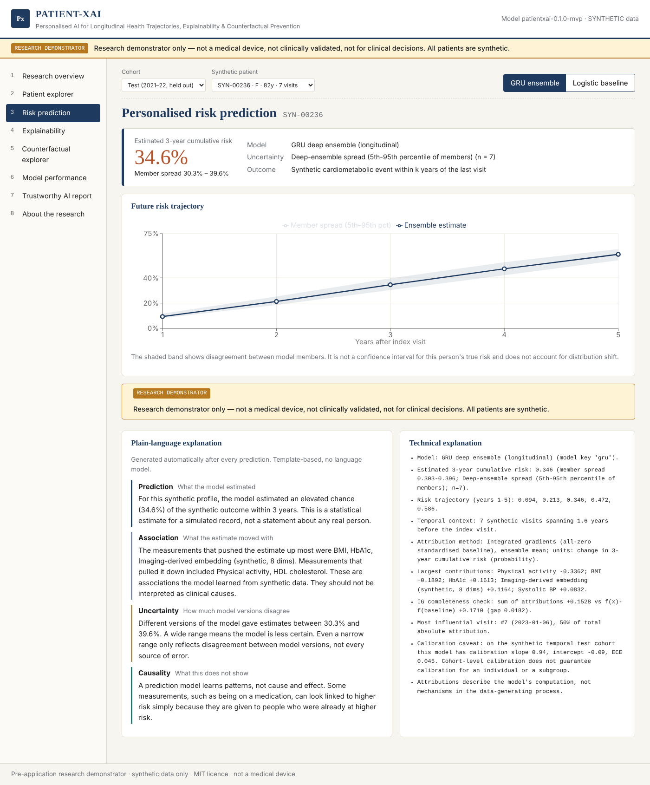
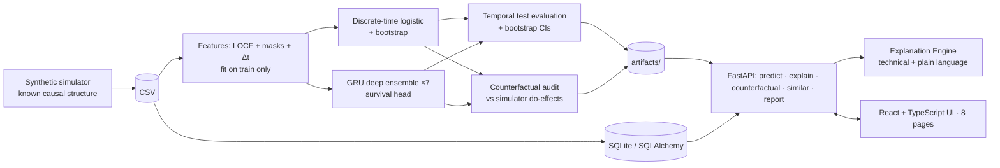

# PATIENT-XAI

**Personalised Artificial Intelligence for Longitudinal Health Trajectories, Explainability and Counterfactual Prevention**

> ⚠️ **Research demonstrator only.** Not a medical device. Not clinically validated. Not for diagnosis,
> treatment or any clinical decision. **Every patient in this repository is synthetic.**

PATIENT-XAI is a small, fully reproducible test-bed for one question:

*When a longitudinal model produces a personalised risk trajectory, an explanation and a "what-if"
simulation for one person, which parts of that output can be trusted — and which cannot?*

It trains a transparent survival baseline and a GRU deep ensemble on a synthetic longitudinal cohort whose
data-generating process is **known**, so every prediction, attribution and counterfactual can be checked
against ground truth. It was built as a **pre-application research demonstrator** for doctoral study in
Artificial Medical Intelligence. It demonstrates technical preparation and exposes the open problems that
motivate a PhD; it does not solve them.

| | |
|---|---|
| Data | 3,000 synthetic patients, 3–13 irregular visits, missing labs, synthetic imaging embeddings, censored 1–5-year outcome |
| Models | Discrete-time survival logistic regression (+30 bootstraps) · GRU deep ensemble (×7) · no-imaging ablation |
| Trust layer | Uncertainty · exact & integrated-gradient attribution · temporal importance · counterfactual simulation audited against simulator truth · latent-space neighbours · template Explanation Engine · HTML/PDF reports |
| Stack | Python 3.12, PyTorch, scikit-learn, FastAPI, SQLAlchemy/SQLite · React 18 + TypeScript + Vite + Recharts · Docker Compose |
| Tests | 39 pytest (unit, model, integration, reproducibility) + 7 Vitest — see [Testing](#testing) |

<!-- Screenshots: docs/screenshots/*.png — replace with your own after running -->


---

## Contents
[Research motivation](#research-motivation) · [Architecture](#architecture) · [Quick start (Docker)](#quick-start-docker) ·
[Local development](#local-development) · [Usage](#usage) · [Methodology](#methodology) · [Evaluation](#evaluation) ·
[Explainability](#explainability) · [Uncertainty](#uncertainty) · [Counterfactual analysis](#counterfactual-analysis) ·
[Limitations](#limitations) · [Ethics & privacy](#ethics-and-privacy) · [Reproducibility](#reproducibility) ·
[Testing](#testing) · [Roadmap](#roadmap) · [Citation](#citation) · [Disclaimer](#disclaimer)

## Research motivation
Health systems hold repeated, irregular, partially missing measurements and, increasingly, images. Models that turn
these into a personal risk trajectory are attractive for prevention, but three gaps make them hard to trust:

1. **Prediction ≠ causation.** "What if this person's blood pressure were lower?" is usually answered by editing a
   model input. That gives P(Y | edited x), not P(Y | do(A = a′)).
2. **Uncertainty is rarely individual.** Cohort calibration says little about one person or one subgroup.
3. **Explanations describe models, not bodies.** Attributions can be faithful to the model and still misleading.

The simulator here is deliberately built so these gaps show up: BMI and HbA1c are *markers* (predictive, not causal),
treatment is *confounded by indication*, an unmeasured frailty affects risk, and later cohorts drift.

## Architecture

The multimodal research architecture that a PhD would build (image encoder + longitudinal encoder → latent patient
state z_t → risk / uncertainty / counterfactual heads) is in [docs/architecture.md](docs/architecture.md).

## Quick start (Docker)
```bash
cp .env.example .env              # optional; defaults work
docker compose up --build         # first build trains the models (~3–6 min CPU)
```
| Service | URL |
|---|---|
| Frontend | http://localhost:3000 |
| API | http://localhost:8000 |
| API docs (OpenAPI) | http://localhost:8000/docs |

For a quick smoke build (small cohort, ~30 s training): `PIPELINE_ARGS=--fast docker compose up --build`.

## Local development
```bash
python -m pip install --index-url https://download.pytorch.org/whl/cpu torch   # optional: CPU-only torch
make install            # pip install -r requirements-dev.txt && npm ci
make pipeline           # simulate → train → evaluate → artifacts/ + docs/results.md
make api                # http://localhost:8000
make web                # http://localhost:5173 (proxies /api to :8000)
```

## Usage
Choose a synthetic patient and a model in the toolbar, then work through the pages:

1. **Research overview** – question, hypotheses, method, architecture, limitations, ethics.
2. **Patient explorer** – visit timeline, latest measurements, trajectory chart, latent-space neighbours.
3. **Risk prediction** – 1–5-year trajectory with uncertainty band and automatic explanations.
4. **Explainability** – signed feature contributions, per-visit importance, completeness check.
5. **Counterfactual explorer** – sliders for SBP, LDL, BMI, HbA1c, activity, smoking; model-based vs simulator truth.
6. **Model performance** – discrimination, calibration, confusion matrix, subgroups, counterfactual audit.
7. **Trustworthy AI report** – export HTML or PDF.
8. **About the research** – how each theme maps to open problems; findings computed live.

## Methodology
- **Outcome:** discrete annual hazards for years 1–5 after the last observed visit; cumulative risk is monotone by construction.
- **Censoring:** handled in training via the discrete-time likelihood; evaluation at each horizon is complete-case.
- **Split:** temporal by enrolment year — train 2015–19, validation 2020 (threshold, early stopping), test 2021–22.
- **Leakage control:** scalers fitted on train only; outcome and simulator truth never used as inputs.

Details: [docs/methodology.md](docs/methodology.md), [MODEL_CARD.md](MODEL_CARD.md), [DATA_CARD.md](DATA_CARD.md).

## Evaluation
All numbers are produced by the pipeline and written to [docs/results.md](docs/results.md); none are typed by hand.
Run of 2026-10-07 (seed 20261007), 3-year horizon, temporal test cohort (n = 564 with known status):

| Model | AUROC (95% CI) | Brier | Calibration slope |
|---|---|---|---|
| Discrete-time logistic baseline | 0.848 (0.810–0.884) | 0.118 | 1.03 |
| GRU deep ensemble | 0.843 (0.801–0.881) | 0.120 | 0.94 |
| GRU without imaging (ablation) | 0.846 (0.809–0.879) | 0.119 | 1.00 |

**The sequence model does not outperform the transparent baseline here, and the imaging input adds nothing
measurable.** That is reported, not hidden: on a simulator with near-linear structure there is little for a GRU to gain.

## Explainability
- Baseline: exact contribution w_j·x_j on the hazard log-odds scale.
- GRU: integrated gradients on the ensemble-mean cumulative risk, with per-visit (temporal) importance and a
  completeness check (sum of attributions vs f(x) − f(baseline)).
- Explanation Engine: deterministic templates that separate **prediction, association, uncertainty, counterfactual
  simulation and causality**; tests fail if any output resembles treatment advice.

## Uncertainty
GRU: deep-ensemble spread (5th–95th percentile of 7 members). Baseline: 30 bootstrap refits. Counterfactual differences
are paired within members. These intervals capture model disagreement only — not aleatoric, label or shift uncertainty.

## Counterfactual analysis
> *Counterfactual scenarios represent model-based simulations and do not establish that modifying a variable will
> causally produce the predicted clinical outcome.*

Because the simulator is known, the pipeline audits model-based simulations against true do-interventions
(150 test patients, 3-year risk). Selected rows from [docs/results.md](docs/results.md):

| Intervention | Causal in simulator | True change | GRU simulated | Baseline simulated |
|---|---|---|---|---|
| Lower SBP by 20 mmHg | yes | −3.4 pts | −2.1 pts | −0.2 pts |
| Lower BMI by 3 kg/m² | no (marker) | 0.0 pts | −2.6 pts | −4.2 pts |
| Lower HbA1c by 0.8% | no (marker) | 0.0 pts | −3.0 pts | −4.3 pts |
| Set antihypertensive flag to 1 | yes | −1.3 pts | +0.5 pts | +1.1 pts |

Both models "reduce risk" by changing variables that have no causal effect, and get the **sign** wrong for treatment
initiation because treatment is confounded by indication. This is the central motivation for the proposed PhD.

## Limitations
Synthetic simulator written by the author · no clinical or external validation · synthetic imaging embeddings, not images ·
counterfactuals edit only the index visit · complete-case evaluation (no IPCW) · one temporal split · sex is the only
subgroup · no authentication on the API. Full list: [docs/research_problems.md](docs/research_problems.md).

## Ethics and privacy
No real data, no human participants. Disclaimers on every screen, response header and report; audit log of predictions
with model version. See [ETHICS.md](ETHICS.md) and [SECURITY.md](SECURITY.md).

## Reproducibility
Deterministic simulator and seeds; data hash and full config recorded in `artifacts/manifest.json`; artifacts are
trained inside the Docker image at build time; `docs/results.md` is regenerated from artifacts; CI workflow in
`.github/workflows/ci.yml`.

## Testing
```bash
make test-unit          # simulator, splits, explanation engine
make test-model         # risk-curve validity, IG completeness, exact linear attribution, counterfactual identity
make test-integration   # every API endpoint incl. validation errors and HTML/PDF/JSON reports
make test-frontend      # Vitest component tests
make lint               # ruff + tsc
make docker-build       # compose validation + image build
```
Results recorded in [docs/TEST_RESULTS.md](docs/TEST_RESULTS.md).

## Roadmap
- v0.2: IPCW evaluation; conformal survival intervals; shift detection between cohorts.
- v0.3: time-varying treatment and g-computation / target-trial-emulation baseline for counterfactuals.
- v0.4: real image encoder on an openly licensed dataset; missing-modality handling.
- v0.5: external validation on an approved real-world cohort (subject to ethics and data access) — PhD territory.

## Citation
See [CITATION.cff](CITATION.cff).


## Disclaimer
PATIENT-XAI is a research demonstrator. It is not a medical device, has no regulatory approval, has not been clinically
validated and must not be used for diagnosis, treatment or any decision about a person. All data are synthetic.
