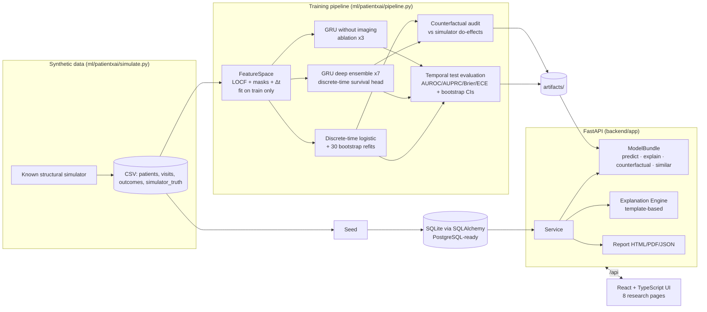

# Architecture



## Future multimodal research architecture (PhD target, not implemented)

```mermaid
flowchart LR
  IMG[Imaging series I_t] --> IE[Image encoder<br/>pretrained CNN/ViT]
  TAB[Irregular visits X_1..X_t] --> TE[Longitudinal encoder<br/>continuous-time / temporal transformer]
  CTX[Static context C] --> FUSE
  IE --> FUSE[Fusion with missing-modality handling]
  TE --> FUSE
  FUSE --> Z[Personalised latent state z_t]
  Z --> P[Risk head<br/>P(Y_t+k given z_t)]
  Z --> U[Uncertainty head<br/>ensembles / conformal / shift-aware]
  Z --> CF[Counterfactual head<br/>P(Y_t+k given do(A=a'), z_t)<br/>only under stated identification assumptions]
  P & U & CF --> EXP[Explanations + individual calibration checks]
```
